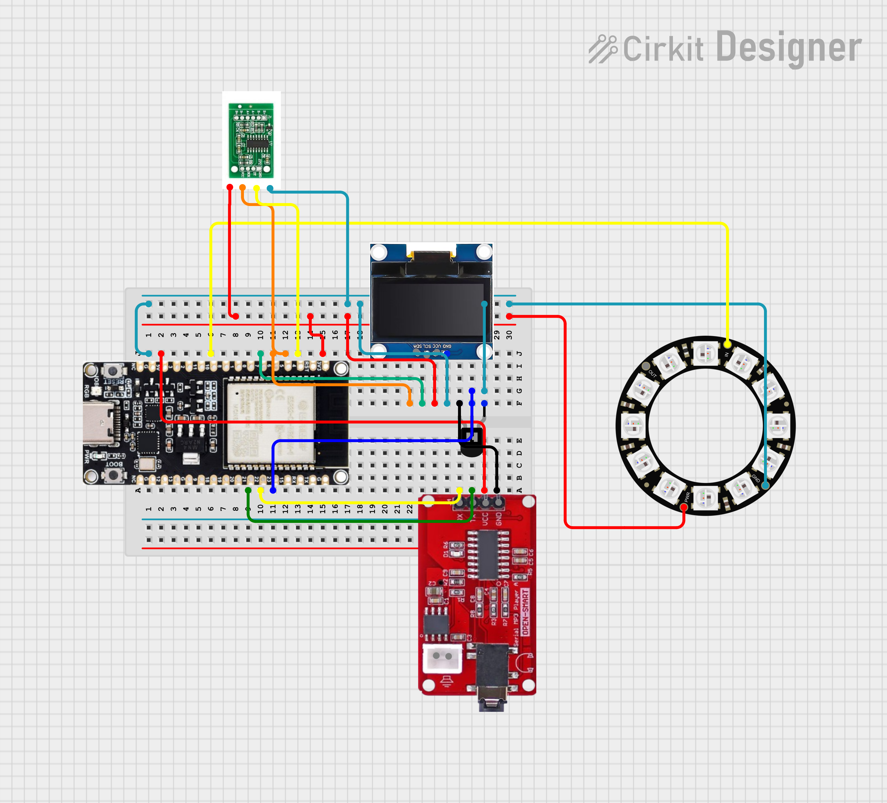
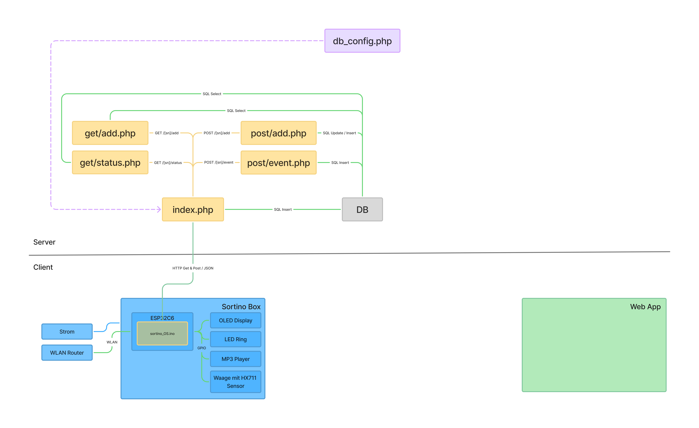

# Sortino

## Inhaltsverzeichnis

- [Kurzbeschreibung des Projekts](#kurzbeschreibung-des-projekts)
- [UX & Konzeption](#ux--konzeption)
- [Setup](#setup)
- [Technische Details](#technische-details)
- [Known bugs](#known-bugs)
- [Umsetzungsprozess](#umsetzungsprozess)

## Kurzbeschreibung des Projekts

* **Modul:** Interaktive Medien 4 an der Fachhochschule Graubünden (FS26)  
* **Themenfeld:** IoT-Applikation zum Thema Eltern mit kleinen Kindern  
* **Name des Projekts:** Sortino   
* **Team Physical Computing:** Carlo Pierotto & Luc Guerraz
* **Team WebApp:** Tim Brönimann, Tim Eberbard

Kinder räumen ungerne ihr Zimmer auf und Eltern haben es gern wenn es am Abend aufgeräumt ist. 
Unsere Kiste motiviert Kinder zum aufräumen, sie erlässt jeden Abend um 18:30 einen Reminder zum aufräumen und um 19:00 einen Lob oder eine Ermahnung ja nach dem ob aufgeräumt worden ist oder nicht.
Die Kiste erkennt Spielzeuge anhand des Gewichts. 
Über die Web-App können die Eltern einsehen, welche Spielzeuge gerade ausserhalb der Kiste sind, und welches die beliebtesten Spielzeuge sind.

* **WebApp:** [https://im04.tim-broenimann.ch](https://im04.tim-broenimann.ch)  
* **Video-Dokumentation:** [Link zum Video auf Youtube](https://www.youtube.com/watch?v=574Dd3WErXQ) 

## UX & Konzeption

*In diesem Teil werden die gemeinsamen Schritte aus der UX-Abgabe dokumentiert, damit sich hier alles vollständig an einem Ort befindet (betrifft WebApp und Physical Computing)*

### Figma:
[Link zum Figma](https://www.figma.com/design/I6OaVpQoHoBlVxiTwrd5Yo/App-Konzeption?node-id=0-1&t=EXwHhpwK3AQBsHQe-1)
### User Flow \+ Screen Flow (Screenshot aus Figma)

### Weitere Ergänzungen

#### Welche Features waren angedacht?

##### Folgene Features wurden umgesetzt:

Die Aktuelle Webapp, so wie sie jetzt steht, enthält die Basis unserer geplanten Features. Die Webapp erlaubt es eine Spielzeugkiste zu haben, die jederzeit weiss, welche Spielzeuge akteull in der Spielzeugkiste sind und welche nicht. Anhand des Gewichts des Spielzeuges erkennt die Kiste, ob ein Speilzeug gerade in der Kiste ist oder nicht. Über die Spielzeug-Seite können die Spielzeuge verwaltet werden. Man kann neue Spielzeuge hinzufügen, ihnen neue Namen geben oder Spielzeuge wieder löschen (wenn man sie z.B. verkauft hat). Dort sieht man ebenfalls einen Überblick über die Nutzungshäufigkeit der Spielzeuge. In den Einstellungen kann ich mein Profil bearbeiten und meinen Haushalt verwalten. Das heisst, ich kann meinem Haushalt Kisten hinzufügen. Auf der Seite sehe ich meinen Haushaltscode mit welchem andere Erziehungsberechtigte meinem Haushalt beitreten können. Diese kann ich in den Einstellungen auch wieder entfernen (z.B. wenn sich die Eltern getrennt haben😢). Die Webapp wie sie jetzt entwickelt ist, ist für die Erziehungsberechtigten entwickelt. Somit kann die Bildschirmzeit der Kinder reduziert werden.

##### Und, folgende Features wurden nicht umgesetzt:

|Feature|Teil|Erklärung|
|-|-|-|
|Erkennung über RFID|MC|In der ersten Konzeptionsphase war die Idee, die spielzeuge anhand eines RFID-Chips zu erkennen. Über mehrere Antennen hätte die Box das Spielzeug automatisch erkennen sollen, wenn das Spielzeug mit dem Chip in die Box gesetzt wird.|
|Rollen für User|WebApp|Im Ursprünglichen System. Eltern erhalten Admin-Rechte für die Web-App. Kinder benötigen nicht zwingend Zugriff auf die Webapp, jedoch ist in der Webapp ersichtlich, welches Kind wie viele Punkte hat (also wie gut es aufträumt). Damit das System funktioniert, hätte die Box nicht einem Haushalt sondern einem User zugewiesen werden müssen. Die Punkte kann das Kind sammeln und gegen Belohnungen einlösen. Weil das Punktesystem wegfiel und Kisten direkt dem Haushalt hinzugefügt wurden, fiel das Rollensystem weg. Kinder können ohne Umstände die Box benutzen während die Eltern Kontrolle über die Box haben.|
|Gamification|WebApp|Punkte sammeln:<br>Jeden Abend um eine vordefinierte Uhrzeit gibt die Box ein Signal, dass es bald Zeit ist, aufzuräumen. Nach ca. 30 Minuten kontrolliert die Webapp automatisch, ob heute Spielzeuge genutzt wurden und ob alle Spielzeuge in der Kiste sind. Wenn zu diesem Zeitpunkt alles aufgeräumt ist, erhält das Kind einen Punkt. Über die Webapp können die Eltern mit ihren Adminrechten im Punkteverlauf ebenfalls Punkte hinzufügen, wenn das Kind z.B. im Haushalt mal ausserordentlich mitgeholfen hat. Die Eltern können dort ebenfalls erhaltene Punkte wieder löschen. Sowohl auf der Webapp wie auch auf dem physischen Display an der Box ist ersichtlich, wie viele Punkte gesammelt wurden und wie nah man an den Belohnungen ist. Dieses Feature wurde gestrichen um den Rahmen des Projektes nicht zu sprengen, weil die Webapp schon genug Features hatte und der Aufwand zu gross geworden wäre.<br><br>Punkte einlösen:<br>Über die Belohnungsseite können die Eltern für einen Haushalt Belohnungen definieren und die Belohnung den Kindern zuweisen. Die Eltern können festlegen, wie viele Punkte eine Belohnung kosten soll. Hat das Kind eine Belohnung eingelöst, müssen es die Eltern über die Webapp einlösen. Die Punkte werden vom aktuellen Punktestand abgezogen. Weil die Gamification weg fiel wurde das Belohnungssystem ebenfalls gestrichen.|
|Gamification|MC|Lange war geplant, der Box ein Aufräum-Feature zu verpassen. Dabei schlägt die Box vor, welches Spielzueg als nächstes eingeräumt werden sollte. Schafft man es innerhalb einer gweissen Ziet, erhält das Kind zusätzliche Punkte. Z.B. steht "Bring mir als nächstes das Piratenschiff" und ein Countdown. Dabei priorisiert die Box schwere Spielzeuge zuerst (siehe nächstes Feature). Dieses Feature wurde gestrichen um den Rahmen des Projektes nicht zu sprengen, weil die Webapp und MC schon genug Features hatte und der Aufwand zu gross geworden wäre.|
|Kategorien für Spielzeuge|WebApp|Ursprünglich war gedacht, dass man beim hinzufügen eines Spielzeuges klassifizierungen geben kann, z.B. ob ein Spielzeug schwer oder fragile ist. In der Aufräum-Gamification hätte die Box priorisieren sollen, zuerst schwere Spielzeuge einzuräumen und erst dann die leichten, welche schnell kaputt gehen können. Weil die Box-Gamification weg fiel, wurde diese Angabe bei den Speilzeugen entfernt. Das gewicht wird lediglich genutzt, weil anhand des Gewichts das jeweilige Spielzeug erkannt wird. Dieses Feature wurde nicht eingebaut, weil die Gamification weg fiel. Die Box musste nicht mehr zwingend wissen, welche Spielzeuge zuerst eingeräumt werden müssen. Deswegen wurde dieses Feature überflüssig.|
|Kontrolle über Gamification|WebApp|In der Webapp sollte es in einem Haushalt mehrere Rollen geben. Eltern hätten Admin-Rechte und könnten Einstellungen an der Gamification vornehmen z.B. wie viel Punkte das Kind fürs Aufräumen bekommt, wie viele Punkte eine Belohnung kostet, wann der Stichzeitpunkt wo die Kiste kontrolliert, ob alles versorgt ist und man hätte einstellen können, wie hoch die Toleranz ist, wie viele Spielzeuge über nach draussen bleiben dürfen. Das Kind hätte dann trotzdem einen Punkt erhalten, auch wenn z.B. zwei Spielzeuge nicht eingeräumt sind. Die Gamification hätte man auch vollkommen deaktivieren können. Dann würde das Punktesystem für den Entsprechenden Haushalt deaktiviert sein. Weil die Gamification weg fiel müssen die Game-Settings nicht mehr eingestellt werden.|

## Setup

### Installationsanleitung WebApp

#### Infrastruktur + Installation
Für die Webapp wird ein Hosting mit einer Domain benötigt. Als Beispiel eignen sich Anbieter wie Infomaniak oder Hostpoint. Dort laufen sowohl die Webseite als auch die Datenbank. Die Webapp selbst besteht aus PHP, JavaScript sowie HTML/CSS.
Zusätzlich wird eine MySQL-Datenbank benötigt, welche über das Hosting erstellt werden kann. Der Zugriff auf die Datenbank erfolgt über phpMyAdmin. Damit sich die Webseite mit der Datenbank verbinden kann, müssen die Zugangsdaten in der Datei config.php eingetragen werden. Dazu gehören der Host, der Datenbankname, der Benutzername sowie das Passwort.
Wichtig ist, dass die config.php Datei nicht öffentlich auf GitHub hochgeladen wird, da sie sensible Zugangsdaten enthält. Deshalb sollte sie über die .gitignore Datei ausgeschlossen werden.
Für die Zusammenarbeit im Team wurde GitHub verwendet. Alternativ könnte auch eine andere Plattform zur Versionsverwaltung genutzt werden. Der Code kann anschliessend über eine SFTP-Verbindung direkt auf den Webserver hochgeladen und synchronisiert werden.
Die physische Sortino-Box benötigt ausserdem eine Stromversorgung sowie eine WLAN-Verbindung aus dem Haushalt, damit sie mit der Datenbank kommunizieren kann.

#### Datenbank importieren und verbinden
Die Datenbank kann direkt über das Hosting erstellt werden. Danach werden die benötigten Tabellen in die Datenbank importiert. In unserem Fall enthält die Datenbank unter anderem Tabellen für Haushalte, Benutzer:innen, Kisten sowie Spielzeuge und das Heraus-/Zurücklegen der Spielzeuge.
Im Projekt befindet sich zusätzlich eine db.sql Datei. Diese enthält die Struktur der gesamten Datenbank und kann über phpMyAdmin importiert werden. Dadurch werden alle benötigten Tabellen automatisch erstellt.
Damit die Webapp auf diese Daten zugreifen kann, muss die Verbindung in der config.php Datei eingerichtet werden. Dort werden die Zugangsdaten der Datenbank eingetragen. Dazu gehören der Host, der Datenbankname, der Benutzername und das Passwort.
Nach der erfolgreichen Verbindung kann die Webapp Daten lesen und neue Informationen abspeichern. Dazu gehören beispielsweise neue Haushalte, registrierte Kisten oder die gespeicherten Gewichte der Spielzeuge.
Die Kommunikation zwischen der Sortino-Box und der Webapp läuft über die Datenbank. Die Box speichert neue Informationen direkt dort ab. Die Webapp liest diese Daten anschliessend aus und stellt sie für die Eltern übersichtlich dar.
Dadurch kann später angezeigt werden:
•	welche Spielzeuge momentan fehlen
•	wann ein Spielzeug zuletzt verwendet wurde
•	wie oft ein Spielzeug aus der Kiste genommen wurde
•	welche Kisten zu einem Haushalt gehören
Ein Haushalt kann mehrere Kisten besitzen. Die Daten (Spielzeuge) aller Kisten werden anschliessend gemeinsam in der Webapp dargestellt.

#### Erststart der Webapp und Einrichtung
Nach dem Kauf der Sortino-Box besucht der User zuerst die Sortino-Webseite. Die Startseite der Webapp ist gleichzeitig die Login- und Registrierungsseite.
Zuerst wird ein Benutzerkonto mit Name, E-Mail-Adresse und Passwort erstellt. Nach dem ersten Login erkennt die Webapp, dass der Account noch keinem Haushalt zugeordnet ist.
Anschliessend kann entweder einem bestehenden Haushalt über einen Code beigetreten oder ein neuer Haushalt erstellt werden. Beim Erstellen eines neuen Haushalts wird dessen Name in der Datenbank gespeichert und mit einer eigenen household_id versehen.
Danach kann die gekaufte Sortino-Box hinzugefügt werden. Dazu wird die Seriennummer verwendet, welche auf der Unterseite der Box eingraviert ist. Diese Seriennummer ist bereits in der Datenbank vorhanden, jedoch noch keinem Haushalt zugewiesen.
Sobald die Kiste erfolgreich verbunden wurde, kann ihr ein eigener Name gegeben werden. Dies ist beispielsweise sinnvoll, wenn mehrere Kinder oder mehrere Kisten in einem Haushalt vorhanden sind.
Im letzten Schritt können Spielzeuge hinzugefügt werden. Dafür wird einem Spielzeug zuerst in der Webapp ein Name gegeben. Anschliessend wird das Spielzeug in die Kiste gelegt. Die Box erkennt die Gewichtsveränderung und speichert diese zusammen mit der passenden household_id in der Datenbank ab.
Dadurch kann später erkannt werden, wann ein Spielzeug aus der Kiste genommen oder wieder zurückgelegt wurde.


### Bauanleitung Physical Computing

Um das physische Artefakt nachbauen zu können muss mann die Komponenten nach Komponentenliste & Steckplan zusammen bauen. Danach müssen die WLAN Credentials in der `sortino_OS.ino`-Datei hinterlegt werden, sie muss anschliessend kompiliert werden und auf das Microcontroller hochladen werden.

#### Komponenten
- ESP32C6
- OLED Display
- MP3 Player mit Lautsprecher
- LED Ring (12 LEDs)
- Gewichtssensor

Der ESP32C6 ist das Kernstück, woran alle Physischen Komponenten verbunden werden.
Im Steckplan sieht man, an welche Pins, welche Komponenten angeschlossen werden.

#### Steckplan


#### Programme

|Datei|Rolle|
|--|--|
|`sortino_OS.ino`|Das Hauptprogramm, welches Setup und Loop festlegt. Im Setup wird die WLAN-Verbindung erstellt und sowohl der Gewichtssensor als auch der Audioplayer initialisiert. In der Loop wird die Uhrzeit überprüft, um den Aufräum-Reminder auszulösen. Es wird nach Gewichtsänderungen überprüft, um das Reinlegen oder Herausnehmen von Spielzeugen zu erfassen. Ebenso wird nach dem `add_mode` überprüft, um neue Spielzeuge zu erfassen.|
|`cJSON/cJSON.c`|Arduino JSON Library|
|`cJSON/cJSON.h`|Arduino JSON Library|
|`Adafruit_BusIO_Register.cpp`|Arduino Adafruit GFX dependency. Arduino Adafruit Bus IO Library|
|`Adafruit_BusIO_Register.h`|Arduino Adafruit GFX dependency. Arduino Adafruit Bus IO Library|
|`Adafruit_GenericDevice.cpp`|Arduino Adafruit GFX dependency. Arduino Adafruit Bus IO Library|
|`Adafruit_GenericDevice.h`|Arduino Adafruit GFX dependency. Arduino Adafruit Bus IO Library|
|`Adafruit_GFX.cpp`|OLED Display funktionalität. Arduino Adafruit GFX Library|
|`Adafruit_GFX.h`|OLED Display funktionalität. Arduino Adafruit GFX Library|
|`Adafruit_I2CDevice.cpp`|Arduino Adafruit GFX dependency. Arduino Adafruit Bus IO Library|
|`Adafruit_I2CDevice.h`|Arduino Adafruit GFX dependency. Arduino Adafruit Bus IO Library|
|`Adafruit_I2CRegister.h`|Arduino Adafruit GFX dependency. Arduino Adafruit Bus IO Library|
|`Adafruit_NeoPixel.cpp`|LED Ring funktionalität. Arduino Adafruit NeoPixel Library|
|`Adafruit_NeoPixel.h`|LED Ring funktionalität. Arduino Adafruit NeoPixel Library|
|`Adafruit_SPIDevice.cpp`|Arduino Adafruit GFX dependency. Arduino Adafruit Bus IO Library|
|`Adafruit_SPIDevice.h`|Arduino Adafruit GFX dependency. Arduino Adafruit Bus IO Library|
|`Adafruit_SSD1306.cpp`|OLED Display funktionalität. Arduino Adafruit SSD1306 Library|
|`Adafruit_SSD1306.h`|OLED Display funktionalität. Arduino Adafruit SSD1306 Library|
|`Arduino_JSON.h`|Arduino JSON Library|
|`audioplayer.h`|Audio player funktionalität. Diese Datei wird in mc.ino eingebunden.|
|`esp.c`|LED Ring funktionalität. Arduino Adafruit NeoPixel Library|
|`gfxfont.h`|OLED Display funktionalität. Arduino Adafruit GFX Library|
|`glcdfont.c`|OLED Display funktionalität. Arduino Adafruit GFX Library|
|`HX711.cpp`|Gewichsensor funktionalität. Arduino HX711 Library|
|`HX711.h`|Gewichsensor funktionalität. Arduino HX711 Library|
|`JSON.cpp`|Arduino JSON Library|
|`JSON.h`|Arduino JSON Library|
|`JSONVar.cpp`|Arduino JSON Library|
|`JSONVar.h`|Arduino JSON Library|
|`splash.h`|OLED Display funktionalität. Arduino Adafruit SSD1306 Library|

#### Kommunikationswege / API Schnittstellen

##### Kisten status abfragen (`api/physical/lib/get/add.php`)
Wird alle 3 Sekunden abgefragt, um zu wissen ob die Kiste neue Spielzeuge jetzt messen muss
```bash
curl -X GET 'https://im04.tim-broenimann.ch/api/physical/[seriennumer]/add'
```
```json
{
  "status": "success",
  "data": {
    "add_mode": false
  }
}
```

##### Spielzeug hinzufügen, gewicht erfassen (`api/physical/lib/post/add.php`)
Wird abgefragt, um das Gewicht eines neues Spielzeug zu erfassen
```bash
curl -X POST 'https://im04.tim-broenimann.ch/api/physical/[seriennumer]/add' \
  --header 'Content-Type: application/json' \
  --data '{"weight": 140}'
```
```json
{
  "status": "success",
  "data": {
    "name": "Neues Spielzeug Name"
  }
}
```

##### Spielzeug wird in kiste gelegt/herausgenommen (`api/physical/lib/post/event.php`)
Wird abgefragt, um eine Gewichtänderung in der Kiste zu erfassen.
```bash
curl -X POST 'https://im04.tim-broenimann.ch/api/physical/[seriennumer]/event' \
  --header 'Content-Type: application/json' \
  --data '{"weight": 87.0}'
```
```json
{
  "status": "success",
  "data": {
    "name": "Spielzeug Name",
    "movement": 1
  }
}
```

##### Sind alle Spielzeuge in der Kiste (`api/physical/lib/get/status.php`)
Wird abgefragt, um zu wissen ob alle Spielzeuge in der Kiste sind und zu wissen wieviele fehlen/da sind
```bash
curl -X GET 'https://im04.tim-broenimann.ch/api/physical/[seriennumer]/status'
```
```json
{
  "status": "success",
  "data": {
    "all_in_box": true,
    "in_box": 14,
    "out_box": 0
  }
}
```


## Technische Details

### Komponentenplan



### Projektstruktur / Code-Struktur \[*Hinweis: Der Code selbst muss im Repository liegen und im Kopfbereich jeder Datei eine kurze Zusammenfassung enthalten.*\] 
.
├── api                                         ← Alle Backend-Endpoints (geben JSON zurück)
│   ├── physical                                ← Microcontroller Endpoints
│   │   ├── lib                                 ← Programm Code
│   │   │   ├── get                             ← alle GET Methoden
│   │   │   │   ├── add.php                     ← Kisten "add_mode" Status laden
│   │   │   │   └── status.php                  ← Kisten Inhalt Status laden
│   │   │   ├── post                            ← alle POST Methoden
│   │   │   │   ├── add.php                     ← Spielzeug Gewicht erfassen
│   │   │   │   └── event.php                   ← Kiste Gewichtänderung verarbeiten
│   │   │   └── .htaccess                       ← verbeitet direkter Zugang zur lib
│   │   ├── .htaccess                           ← leitet alle Anfragen auf index.php
│   │   └── index.php                           ← vorsortiert Anfragen und führt Code der lib aus
│   ├── add_toy.php                             ← xy...
│   ├── auth.php                                ← xy...
│   ├── dashboard.php                           ← xy...
│   ├── household.php                           ← xy...
│   ├── login.php                               ← xy...
│   ├── logout.php                              ← xy...
│   ├── name_toy.php                            ← xy...
│   ├── new_box.php                             ← xy...
│   ├── newhousehold.php                        ← xy...
│   ├── profil.php                              ← xy...
│   ├── profilUpdate.php                        ← xy...
│   ├── register.php                            ← xy...
│   ├── settings.php                            ← xy...
│   ├── toy.php                                 ← xy...
│   └── toyUpdate.php                           ← xy...
├── css                                         ← xy...
│   ├── desktop.css                             ← xy...
│   ├── master.css                              ← xy...
│   └── mobile.css                              ← xy...
├── images                                      ← xy...
│   ├── nav                                     ← xy...
│   │   ├── nav_gifts.svg                       ← xy...
│   │   ├── nav_home.svg                        ← xy...
│   │   ├── nav_points.svg                      ← xy...
│   │   ├── nav_settings.svg                    ← xy...
│   │   └── nav_toys.svg                        ← xy...
│   ├── DEMO_toy_loeschen.png                   ← xy...
│   ├── DEMO_toy_update.png                     ← xy...
│   ├── sortino_bildmarke.png                   ← xy...
│   ├── sortino_favicon.png                     ← xy...
│   ├── sortino_marke.png                       ← xy...
│   └── sortino_textmarke.png                   ← xy...
├── js                                          ← xy...
│   ├── add_toy.js                              ← xy...
│   ├── auth.js                                 ← xy...
│   ├── dashboard.js                            ← xy...
│   ├── data.js                                 ← xy...
│   ├── join_household.js                       ← xy...
│   ├── login.js                                ← xy...
│   ├── logout.js                               ← xy...
│   ├── name_toy.js                             ← xy...
│   ├── new_box.js                              ← xy...
│   ├── new_household.js                        ← xy...
│   ├── profil.js                               ← xy...
│   ├── register.js                             ← xy...
│   ├── settings.js                             ← xy...
│   └── toy.js                                  ← xy...
├── pysical                                     ← Alles für das Microcontroller
│   ├── 3D Druck
│   │   └── 3d Druck.3mf                        ← 3D Model für die Kiste
│   ├── Audios                                  ← Audios für die SD Karte der Audio Interface
│   │   ├── 01.mp3
│   │   ├── 02.mp3
│   │   └── 03.mp3
│   └── sortino_OS                              ← Arduino Projekt
│       ├── cJSON                               ← Arduino Libraries
│       │   ├── cJSON.c                         ← Arduino Libraries
│       │   ├── cJSON.h                         ← Arduino Libraries
│       │   └── LICENSE                         ← Arduino Libraries
│       ├── Adafruit_BusIO_Register.cpp         ← Arduino Libraries
│       ├── Adafruit_BusIO_Register.h           ← Arduino Libraries
│       ├── Adafruit_GenericDevice.cpp          ← Arduino Libraries
│       ├── Adafruit_GenericDevice.h            ← Arduino Libraries
│       ├── Adafruit_GFX.cpp                    ← Arduino Libraries
│       ├── Adafruit_GFX.h                      ← Arduino Libraries
│       ├── Adafruit_I2CDevice.cpp              ← Arduino Libraries
│       ├── Adafruit_I2CDevice.h                ← Arduino Libraries
│       ├── Adafruit_I2CRegister.h              ← Arduino Libraries
│       ├── Adafruit_NeoPixel.cpp               ← Arduino Libraries
│       ├── Adafruit_NeoPixel.h                 ← Arduino Libraries
│       ├── Adafruit_SPIDevice.cpp              ← Arduino Libraries
│       ├── Adafruit_SPIDevice.h                ← Arduino Libraries
│       ├── Adafruit_SSD1306.cpp                ← Arduino Libraries
│       ├── Adafruit_SSD1306.h                  ← Arduino Libraries
│       ├── Arduino_JSON.h                      ← Arduino Libraries
│       ├── audioplayer.h                       ← Arduino Libraries
│       ├── esp.c                               ← Arduino Libraries
│       ├── gfxfont.h                           ← Arduino Libraries
│       ├── glcdfont.c                          ← Arduino Libraries
│       ├── HX711.cpp                           ← Arduino Libraries
│       ├── HX711.h                             ← Arduino Libraries
│       ├── JSON.cpp                            ← Arduino Libraries
│       ├── JSON.h                              ← Arduino Libraries
│       ├── JSONVar.cpp                         ← Arduino Libraries
│       ├── JSONVar.h                           ← Arduino Libraries
│       ├── sortino_OS.ino                      ← Microcontroller Code 
│       └── splash.h                            ← Arduino Libraries
├── readme-assets                               ← Bilder für das ReadMe
│   ├── ERM.png
│   ├── ScreenFlow.png
│   └── Steckplan.png
├── system                                      ← xy...
│   ├── config.php                              ← xy...
│   ├── config.php.blank                        ← xy...
│   └── db.sql                                  ← xy...
├── .gitattributes
├── .gitignore
├── add_toy.html                                ← xy...
├── household.html                              ← xy...
├── index.html                                  ← xy...
├── join_household.html                         ← xy...
├── login.html                                  ← xy...
├── name_toy.html                               ← xy...
├── new_box.html                                ← xy...
├── new_household.html                          ← xy...
├── profil.html                                 ← xy...
├── README.md                                   ← Github ReadMe
├── register.html                               ← xy...
├── settings.html                               ← xy...
└── toys.html                                   ← xy...


### Datenschnittstelle
Die `toy_events` und `boxes` Tabellen dienen zur Schnittstelle zwischen das Microcontroller und der Webapp.

Wenn ein Spielzeug aus der Kiste genommen wird, wird ein Eintrag in der `toy_events` Tabelle gemacht.

Wenn man in der App ein neues Spielzeug erfassen will, wird in der `boxes` Tabelle der `add_mode` auf `true` gesetzt, und ein neuer Eintrag in der `toys` Tabelle erstellt, mit einem `weight` von `0`. Wenn 15s nichts in die Box gelegt wird, bricht die App den Vorgang ab. 
Der MC fragt alle drei Sekunden dem Server nach ob die Kisten im add_mode ist, und wenn ja erfasst es das neue Gewicht im `toy` Eintrag von vorher.

### ERM
 
- **households**
  - Zentrale Tabelle für Haushalte/Familien
  - Attribute:
    - `id`
    - `name`
    - `code`
  - Beziehung:
    - Ein Haushalt kann mehrere Benutzer, Kisten und Belohnungen besitzen.

- **users**
  - Speichert Benutzer eines Haushalts
  - Attribute:
    - `id`
    - `email`
    - `password`
    - `firstname`
    - `lastname`
    - `household_id`
  - Beziehung:
    - Mehrere Benutzer gehören zu einem Haushalt.

- **boxes**
  - Speichert Spielzeugkisten eines Haushalts
  - Attribute:
    - `id`
    - `serialnumber`
    - `name`
    - `add_mode`
    - `household_id`
  - Beziehung:
    - Ein Haushalt kann mehrere Kisten besitzen.

- **toys**
  - Speichert Spielzeuge innerhalb einer Kiste
  - Attribute:
    - `id`
    - `name`
    - `weight`
    - `household_id`
  - Beziehung:
    - Ein Haushalt kann mehrere Spielzeuge enthalten.

- **toys_events**
  - Speichert Aktionen/Ereignisse zu Spielzeugen
  - Attribute:
    - `id`
    - `timestamp`
    - `movement`
    - `toy_id`
    - `box_id`
  - Beziehung:
    - Ein Spielzeug kann mehrere Events besitzen.

- **rewards**
  - Speichert Belohnungen eines Haushalts
  - Attribute:
    - `id`
    - `name`
    - `cost`
    - `pinned`
    - `used`
    - `household_id`
  - Beziehung:
    - Ein Haushalt kann mehrere Belohnungen besitzen.

- **reward_events**
  - Speichert ausgelöste Belohnungsereignisse und Punkte
  - Attribute:
    - `id`
    - `trigger`
    - `points`
    - `timestamp`
    - `household_id`
    - `reward_id`
  - Beziehung:
    - Verknüpft Boxen mit Belohnungen und dokumentiert Punkte/Ereignisse.


### Authentifizierung
Die Authentifizierung der Webapp basiert auf PHP-Sessions. Dadurch erhalten nur angemeldete Benutzer:innen Zugriff auf geschützte Seiten und ihre Daten.
Das Login startet auf der `login.html` Seite. Die eingegebenen Login-Daten werden über `login.js` an `login.php` gesendet. Dort werden E-Mail-Adresse und Passwort mit den gespeicherten (und zum teil verschlüsselten) Daten aus der Datenbank verglichen. Für die Passwortprüfung wird `password_verify()` verwendet. Falls die Daten korrekt sind, startet `login.php` die Session. In den PHP-Dateien wird dafür jeweils `session_start()` benötigt, damit auf die Session zugegriffen werden kann. In der Session werden unter anderem `user_id`, E-Mail-Adresse und `household_id` gespeichert.

Beim Laden geschützter Seiten wird automatisch `auth.js` ausgeführt. Diese Datei sendet eine Anfrage an `auth.php`, um zu prüfen, ob noch eine gültige Session vorhanden ist. Falls keine gültige Session existiert, liefert `auth.php` einen `401 Unauthorized` Fehler zurück. `auth.js` leitet den User anschliessend automatisch zurück auf `login.html`. Falls die Session gültig ist, werden `user_id` und E-Mail-Adresse als JSON zurückgegeben.

Weitere Benutzerdaten werden über `profil.php` geladen und in `profil.js` zusammen mit `data.js` verwendet. Auch dort wird zuerst überprüft, ob eine gültige Session vorhanden ist. Die Abmeldung erfolgt über `logout.php`. Dabei wird die aktuelle Session gelöscht und der Benutzer ausgeloggt.

Vereinfachter Datenfluss:
`login.html → login.js → login.php → Datenbank → Session`

Geschützte Seiten:
`auth.js → auth.php → Sessionprüfung → Zugriff erlauben oder Login`


## Known bugs / wichtige Ergänzungen

### User löscht sich selber
Wenn der aktuelle User sich selber aus dem Haushalt entfernen möchte, funktioniert das. Das ist in erster Linie bereits ein wenig fragwürdig. Andererseits wird er dann nicht zurück zu login.html zurückgeschickt, sondern bleibt in der Webapp drinn. Aber da er keinem Haushalt zugehörig ist, werden keine Daten angezeigt und es ist einfach alles auf "0" oder leer.

### Noch keine Spielzeuge
Wenn der User einen neuen Haushalt erstellt, die Spielzeuge aber ist in einem zweiten Schritt hinzufügt, wird ihm auf dem Dashboard trotzdem in grün "Alles aufgeräumt" angezeigt. Optimal wäre wenn hier wie bei toys.html stehen würde, dass zuerst ein Spielzeug hinzugefügt werden sollte.

### Spielzeuge nach Kiste sortieren
Aktuell werden unter toys.html alle Spielzeuge untereinander aufgelistet. Hat der User aber 3 Kisten mit je 20 Spielzeuge kann das etwas unübersichtlich werden. Hier wäre ein Button, der nach Kiste A, B oder C filtern könnte optimal für eine bessere Übersicht.

### Aufräumzeit verwalten
Aktuell fehlt in den Einstellungen noch die Möglichkeit die Uhrzeit einzustellen, bei der das Kind alles aufgerämt haben muss. 

### Spielzeuge hinzufügen
Wir sind uns unsicher, ob das "+" unter toys.html genügen versätnlich ist. Hiermit sollen neue Spielzeuge hinzugefügt werden. Evtl wäre es besser gewesen dies auszuschreiben, damit es direkt erkennbar wird.

* Was funktioniert noch nicht einwandfrei?  
* Was ist uns aufgefallen bei der Entwicklung?  
* Was könnte noch verbessert werden?


## Umsetzungsprozess //Alle

### Zu viel vorgenommen
Zu Beginn waren wir deutlich übermotiviert. Es wäre sehr toll gewesen alle Features und Details umzusetzen. Das wäre aber leider deutlich zu viel Arbeit für uns geworden. Dementsprechend sind wir aber happy mit dem Endresultat wie es herausgekommen ist. Trotzdem juckt es aber in den Fingern weiterzumachen und alle möglichen Funktionen noch ergänzen.

### KI-Nutzung
Vergangene Semester habe ich häufig mit ChatGPT gearbeitet. Dort jeweils mühsam den gesamten Code hochgeladen und versucht herauszufinden was ich wo jetzt neu einfügen muss, damit das Problem gelöst werden konnte. Das war bei diesem Projekt zu Beginn ebenfalls der fall, bis ich den Copilot in VS Code entdeckte. 
Ich finde es großartig, dass man bestimmte Dateien wie register.html und register.js auswählen, einen Prompt formulieren und den Code lesen und bearbeiten kann. So ist es immer klar was die KI berücksichtigen sollte und für mich einfacher nicht alles 100x kopieren und einfügen zu müssen. 
Mithilfe der KI hat der Programmieraspekt auch wirklich Spass gemacht. Man musste sich immernoch überlegen was will ich genau erreichen. Was brauche ich aus der DB und wie will ich es nutzen um mir etwas in der Webapp anzeigen zu lassen. Aber der schwierige Schreibaspekt mit der immernoch komplizierten Syntax wurde erleichtert.
Grundsätzlich habe ich immer überprüft was die KI jetzt neu gecodet / gelöscht hat. So habe ich vermieden, dass er alles löscht und dabei eig mein Prompt falsch verstanden hatte. Mit der Zeit nahm aber das Vertrauen in Copilot zu und ich überprüfte weniger seinen Code und war ehrlich gesagt wengier gewollt alles verstehen zu wollen.
Mit diesem Tool an der Seite fühlt sich IM aber deutlich weniger kompliziert, weniger stressig und effektiv machbar an, was ein schönes Gefühl ist :D. 

### Fazit
Das Projekt hat alles in allem eigentlich Spass gemacht. Vorallem in jenen Momenten, als die Webapp mit der Box harmoniesiert hat und wir Spielzeuge versorgen und hinausnehmen konnten. Der Start war mühsahm, als man wieder in den IM-Modus hineinfinden musste. Sobald aber bei der Webapp der Login/Registrierung/Session Aspekt erledigt war, wurde es weniger kompliziert und machbarer. 
Es ist aber ein tolles Gefühl so eine Webapp entwickelt zu haben, die wirklich so (natürlich noch etwas ausgebauter) auf dem Markt sein könnte, und es vergleichbar  viele ähnliche FUnktionen hat. 

* **Reflexion / Erfahrung / Lernfortschritt:** *Was haben wir gelernt? Würden wir es nochmal genauso machen? Was war gut, was war schlecht?*  
* **Herausforderungen & Lösungen:** \[*Verworfene Ansätze, Fehler, Umplanungen*\]  
* **KI-Einsatz:** *Dokumentation der verwendeten KI-Tools und deren Nutzen (KI ist nicht verboten)*  
* **Fazit:** …
