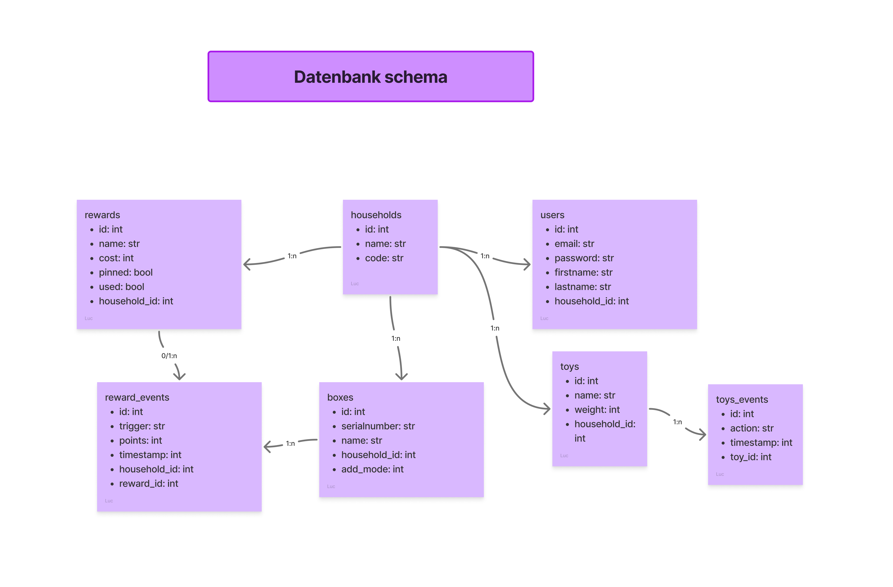

# Sortino

## Inhaltsverzeichnis

- [Kurzbeschreibung des Projekts](#kurzbeschreibung-des-projekts)
- [UX & Konzeption](#ux--konzeption)
- [Setup](#setup)
- [Technische Details](#technische-details)
- [Known bugs](#known-bugs)
- [Umsetzungsprozess](#umsetzungsprozess)

## Kurzbeschreibung des Projekts

* **Modul:** Interaktive Medien 4 an der Fachhochschule Graubünden (FS26)  
* **Themenfeld:** IoT-Applikation zum Thema Eltern mit kleinen Kindern  
* **Name des Projekts:** Sortino   
* **Team Physical Computing:** Carlo Pierotto & Luc Guerraz
* **Team WebApp:** Tim Brönimann, Tim Eberbard

Kinder räumen ungerne ihr Zimmer auf und Eltern haben es gern wenn es am Abend aufgeräumt ist. 
Unsere Kiste motiviert Kinder zum aufräumen, sie erlässt jeden Abend um 18:30 einen Reminder zum aufräumen und um 19:00 einen Lob oder eine Ermahnung ja nach dem ob aufgeräumt worden ist oder nicht.
Die Kiste erkennt Spielzeuge anhand des Gewichts. 
Über die Web-App können die Eltern einsehen, welche Spielzeuge gerade ausserhalb der Kiste sind, und welches die beliebtesten Spielzeuge sind.

\[*Bilder / GIFs (optional)*\]

## UX & Konzeption

*In diesem Teil werden die gemeinsamen Schritte aus der UX-Abgabe dokumentiert, damit sich hier alles vollständig an einem Ort befindet (betrifft WebApp und Physical Computing)*

### Figma:
[Link zum Figma](https://www.figma.com/design/I6OaVpQoHoBlVxiTwrd5Yo/App-Konzeption?node-id=0-1&t=EXwHhpwK3AQBsHQe-1)
### User Flow \+ Screen Flow (Screenshot aus Figma)

### Weitere Ergänzungen

> WEBAPP //Ebi
> * *Welche Features waren angedacht?*
> * *Welche Features wurden nicht umgesetzt? (Warum)*

Für die Spielzeugkiste (Microcontroller) hatten wir ein Gamification-Konzept entwickelt, um das Kind beim Aufräumen zu unterstützen. 
Es hätte das Kind instruiert, welches Spielzeug es als Nächstes in die Kiste legen soll. Dies haben wir nicht umgesetzt, da es den Scope gesprengt hätte.
Auch die Punkte, die man für pünktliches Aufräumen erhalten hätte, haben wir weggelassen, da wir die Belohnungen aus der Webapp aus Zeitgründen gestrichen haben.

## Setup //Luc ist für das Video und diesen Teil verantwortlich

* **WebApp:** [https://im04.tim-broenimann.ch](https://im04.tim-broenimann.ch)  
* **Video-Dokumentation:** [Link zum Video auf Youtube](http://link.zum.video) 

### Installationsanleitung WebApp //Bröner

***verständliche** Schritt-für-Schritt-Anleitung für Aussenstehende, um das Projekt zu klonen und auf einem eigenen Server zu installieren*

1. *Was benötige ich an Infrastruktur?* 
2. *Was muss ich auf meinem Webserver installieren?*  
3. *Wie kann ich die Datenbank importieren?*  
4. *Wo muss ich die DB-Credentials eintragen?*  
5. *…*  
6. *Wie nehme ich das physische Artefakt in Betrieb?*

### Bauanleitung Physical Computing

#### Komponenten //Carlo, Bröner (macht Webapp Teil vom Komponentenplan), Luc macht Server
- ESP32C6
- OLED Display
- MP3 Player mit Lautsprecher
- LED Ring (12 LEDs)
- Gewichtssensor

Der ESP32C6 ist das Kernstück, woran alle Physischen Komponenten verbunden werden.
Im Steckplan sieht man, an welche Pins, welche Komponenten angeschlossen werden.

* ***Was muss ich wie bauen, verbinden, installieren?***  
* *ergänze: **Komponentenplan** (betrifft Physical Computing, vgl. Slides Kapitel 15): Schaubild enthält*  
  * *die eingesetzten Komponenten*  //Carlo
  * *die verbundenen Sensoren und Aktoren*  //Carlo
  * *die Programme (mit Dateinamen)*  //Carlo, Luc
  * *die Kommunikationswege*  //Luc
* *ergänze: **Steckplan** (betrifft Physical Computing, vgl. Slides Kapitel 15): generiert z.B. mit Fritzing (empfohlen), Tinkercad, Wokwi*  
  * *beachtet die [Fritzing Parts](https://github.com/Interaktive-Medien/im_physical_computing/tree/main/15_Intro_Projektdoku) extra für euch*  
* *ggf. **Bildmaterial***

#### Kommunikationswege / API Schnittstellen

##### Kisten status abfragen (`api/physical/lib/get/add.php`)
Wird alle 3 Sekunden abgefragt, um zu wissen ob die Kiste neue Spielzeuge jetzt messen muss
```bash
curl -X GET 'https://im04.tim-broenimann.ch/api/physical/[seriennumer]/add'
```
```json
{
  "status": "success",
  "data": {
    "add_mode": false
  }
}
```

##### Spielzeug hinzufügen, gewicht erfassen (`api/physical/lib/post/add.php`)
Wird abgefragt, um das Gewicht eines neues Spielzeug zu erfassen
```bash
curl -X POST 'https://im04.tim-broenimann.ch/api/physical/[seriennumer]/add' \
  --header 'Content-Type: application/json' \
  --data '{"weight": 140}'
```
```json
{
  "status": "success",
  "data": {
    "name": "Neues Spielzeug Name"
  }
}
```

##### Spielzeug wird in kiste gelegt/herausgenommen (`api/physical/lib/post/event.php`)
Wird abgefragt, um eine Gewichtänderung in der Kiste zu erfassen.
```bash
curl -X POST 'https://im04.tim-broenimann.ch/api/physical/[seriennumer]/event' \
  --header 'Content-Type: application/json' \
  --data '{"weight": 87.0}'
```
```json
{
  "status": "success",
  "data": {
    "name": "Spielzeug Name",
    "movement": 1
  }
}
```

##### Sind alle Spielzeuge in der Kiste (`api/physical/lib/get/status.php`)
Wird abgefragt, um zu wissen ob alle Spielzeuge in der Kiste sind und zu wissen wieviele fehlen/da sind
```bash
curl -X GET 'https://im04.tim-broenimann.ch/api/physical/[seriennumer]/status'
```
```json
{
  "status": "success",
  "data": {
    "all_in_box": true,
    "in_box": 14,
    "out_box": 0
  }
}
```

## Technische Details //Luc

// Hier sollte das Verständnis ersichtlich sein / Wie stehen die Dateien in Beziehung zueinander, Wie reden Die Dateien miteinander, Wie ist der Weg der Daten

### Projektstruktur / Code-Struktur \[*Hinweis: Der Code selbst muss im Repository liegen und im Kopfbereich jeder Datei eine kurze Zusammenfassung enthalten.*\] 

TB: !!!!!!!! --> Kopfbereich


### Datenschnittstelle //Luc
Die `toy_events` und `boxes` Tabellen dienen zur Schnittstelle zwischen das Microcontroller und der Webapp.

Wenn ein Spielzeug aus der Kiste genommen wird, wird ein Eintrag in der `toy_events` Tabelle gemacht.

Wenn man in der App ein neues Spielzeug erfassen will, wird in der `boxes` Tabelle der `add_mode` auf `true` gesetzt, und ein neuer Eintrag in der `toys` Tabelle erstellt, mit einem `weight` von `0`. Wenn 15s nichts in die Box gelegt wird, bricht die App den Vorgang ab. 
Der MC fragt **jede Sekunde?** dem Server nach ob die Kisten im add_mode ist, und wenn ja erfasst es das neue Gewicht im `toy` Eintrag von vorher.

### ERM //Luc
 
- **households**
  - Zentrale Tabelle für Haushalte/Familien
  - Attribute:
    - `id`
    - `name`
    - `code`
  - Beziehung:
    - Ein Haushalt kann mehrere Benutzer, Kisten und Belohnungen besitzen.

- **users**
  - Speichert Benutzer eines Haushalts
  - Attribute:
    - `id`
    - `email`
    - `password`
    - `firstname`
    - `lastname`
    - `household_id`
  - Beziehung:
    - Mehrere Benutzer gehören zu einem Haushalt.

- **boxes**
  - Speichert Spielzeugkisten eines Haushalts
  - Attribute:
    - `id`
    - `serialnumber`
    - `name`
    - `add_mode`
    - `household_id`
  - Beziehung:
    - Ein Haushalt kann mehrere Kisten besitzen.

- **toys**
  - Speichert Spielzeuge innerhalb einer Kiste
  - Attribute:
    - `id`
    - `name`
    - `weight`
    - `household_id`
  - Beziehung:
    - Ein Haushalt kann mehrere Spielzeuge enthalten.

- **toys_events**
  - Speichert Aktionen/Ereignisse zu Spielzeugen
  - Attribute:
    - `id`
    - `timestamp`
    - `movement`
    - `toy_id`
    - `box_id`
  - Beziehung:
    - Ein Spielzeug kann mehrere Events besitzen.

- **rewards**
  - Speichert Belohnungen eines Haushalts
  - Attribute:
    - `id`
    - `name`
    - `cost`
    - `pinned`
    - `used`
    - `household_id`
  - Beziehung:
    - Ein Haushalt kann mehrere Belohnungen besitzen.

- **reward_events**
  - Speichert ausgelöste Belohnungsereignisse und Punkte
  - Attribute:
    - `id`
    - `trigger`
    - `points`
    - `timestamp`
    - `household_id`
    - `reward_id`
  - Beziehung:
    - Verknüpft Boxen mit Belohnungen und dokumentiert Punkte/Ereignisse.
### Authentifizierung \[*Erklärung*\]

## Known bugs //Alle


!!!!!!!!!!!!!


* Was funktioniert noch nicht einwandfrei?  
* Was ist uns aufgefallen bei der Entwicklung?  
* Was könnte noch verbessert werden?

## Umsetzungsprozess //Alle

!!!!!!!!!!!!!!

* **Reflexion / Erfahrung / Lernfortschritt:** *Was haben wir gelernt? Würden wir es nochmal genauso machen? Was war gut, was war schlecht?*  
* **Herausforderungen & Lösungen:** \[*Verworfene Ansätze, Fehler, Umplanungen*\]  
* **KI-Einsatz:** *Dokumentation der verwendeten KI-Tools und deren Nutzen (KI ist nicht verboten)*  
* **Fazit:** …
